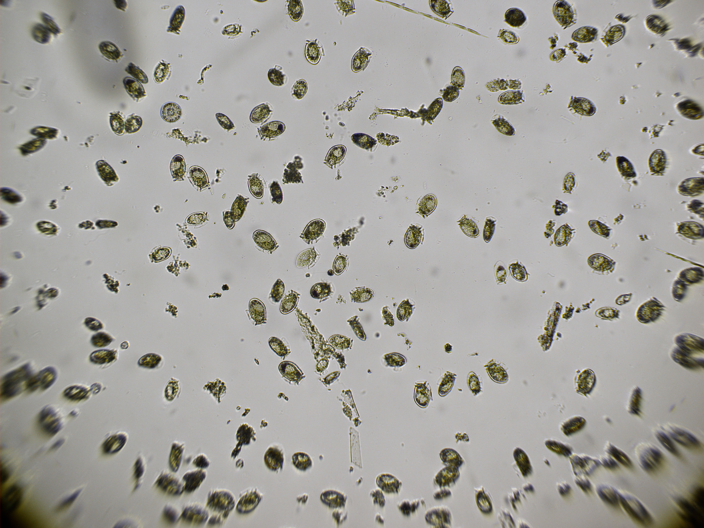

I research phytoplankton, with a focus on algal phytoplankton that cause harmful algal blooms. I employ a range of tools, from imaging, flow cytometry, physical observations, and 'omics, in both lab and natural environments, to better understand the ecology of these small but mighty organisms.

_Postdoctoral Research_
------

Dinoflagellate population genetics
------

Where do they come from, where do they go? Comparing the population composition of blooms can help us trace the origins of blooms, but traditional population genetics approaches face challenges in the dinoflagellate, both because they are microbial and isolating many individuals is hard, and because dinoflagellates have large and highly repetitive genomes. I'm interested in resolving ways we can characterize diversity and heterozygosity within and between dinoflagellate bloom populations. 

_Dissertation Research_
------

<!--  -->

<!--   -->

 My dissertation work has focused on the ecology of the dinoflagellate _Dinophysis_. Many species of _Dinophysis_ produce **diarrhetic shellfish toxins** that can accumulate in filter-feeding shellfish, causing gastrointestinal distress to people who consume said shellfish. [More about _Dinophysis_](https://hab.whoi.edu/species/species-by-name/dinophysis/)

One challenge in understanding when and where _Dinophysis_ blooms happen is that it does not produce its own plastids (aka chloroplasts) for photosynthesis. It instead relies on consuming a specific prey source, the ciliate _Mesodinium_, which moves very quickly in rapid "jumps". Upon doing so, they harvest and appropriate _Mesodinium_'s photosynthetic machinery for up to a few months at a time.

The sex lives of dinoflagellates
------

All eukaryotes have a sexual life cycle, but its occurrence in microbial eukaryotes is often cryptic -- when and where and why do they enter a sexual reproductive cycles? My co-authors and I used imaging flow cytometry to show that [sexual reproduction is common during blooms of _Dinophysis_](/publications/), indicating that sexual reproduction (rather than binary fission) may be a more important mechanism of bloom development than previously thought. 

Interaction between mixotrophy and swimming behavior
------

_Dinophysis_, like many dinoflagellates, can swim. Many dinoflagellates modulate their depth and form thin layers at depths that balance light and nutrient acquisition. Because _Dinophysis_ requires feeding on _Mesodinium_ prey to photosynthesize, this balance is a little more complicated. Our team observed that [a bloom of _Dinophysis_, when deprived of prey, eventually ceases vertical migration](/publications/), resulting in the bloom getting trapped within an inshore coastal pond and driving local acidification and nutrient recycling.

Connectivity of _Dinophysis_ blooms
------

We found several blooms of _Dinophysis_ on the Cape Cod National Seashore that varied in their phenology despite similar environments -- how are these populations related? I leveraged markers from meta-transcriptomic datasets to describe the relatedness between these populations with different bloom dynamics. This work is continuing through my postdoctoral research -- stay tuned!

